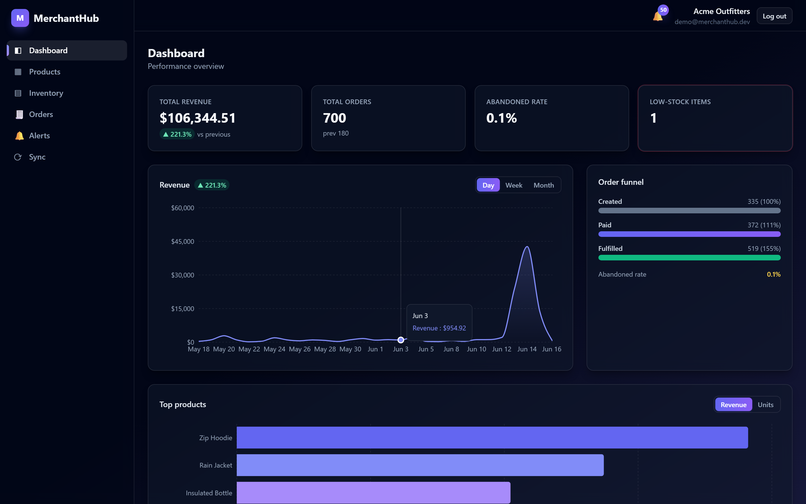
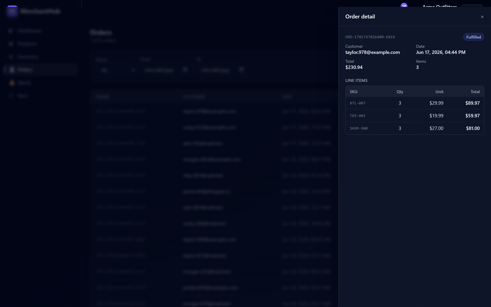
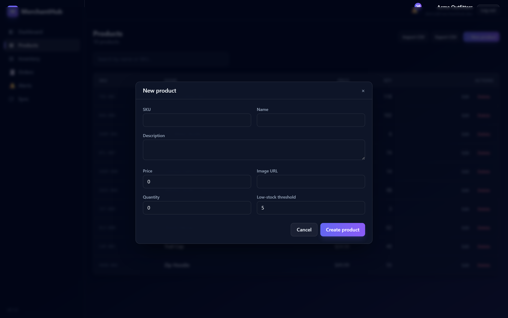
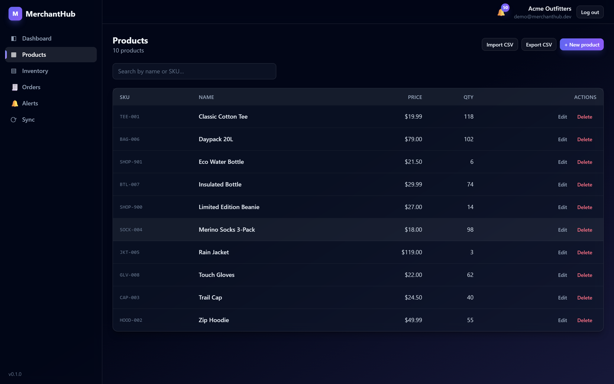
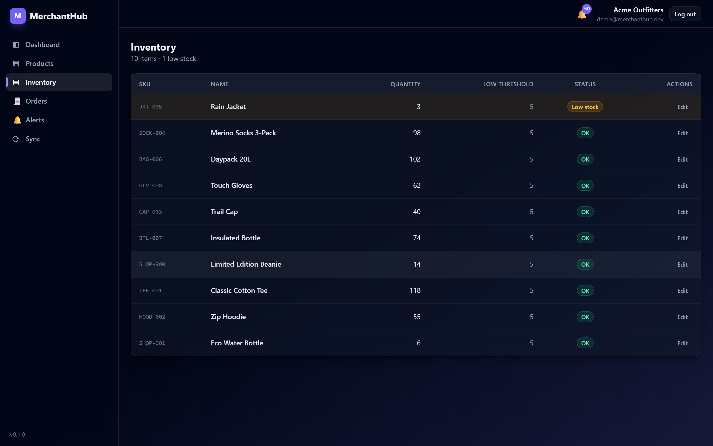
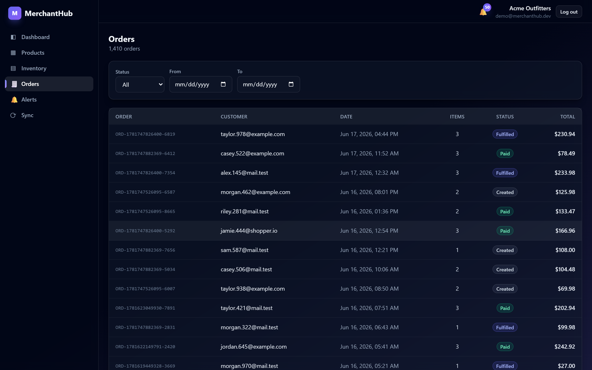
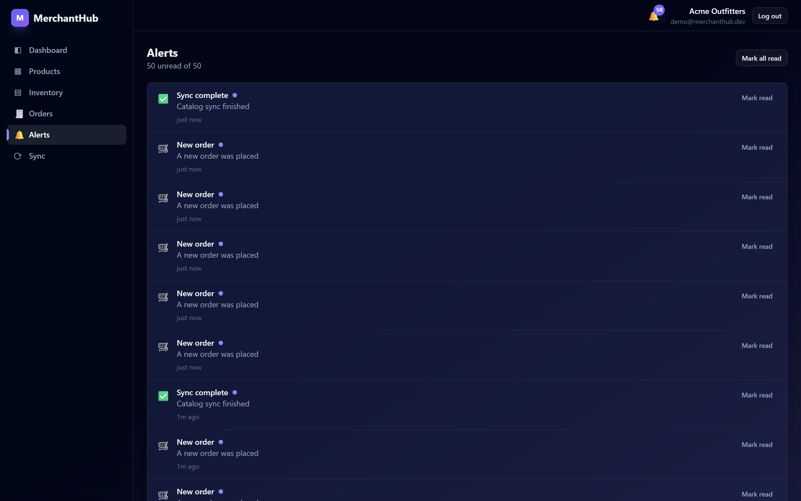
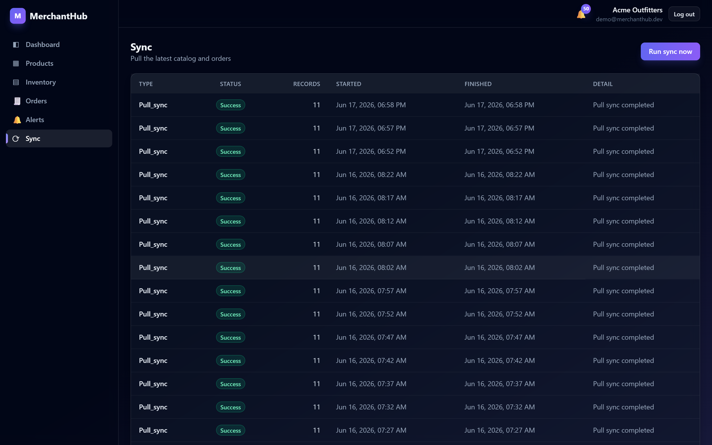
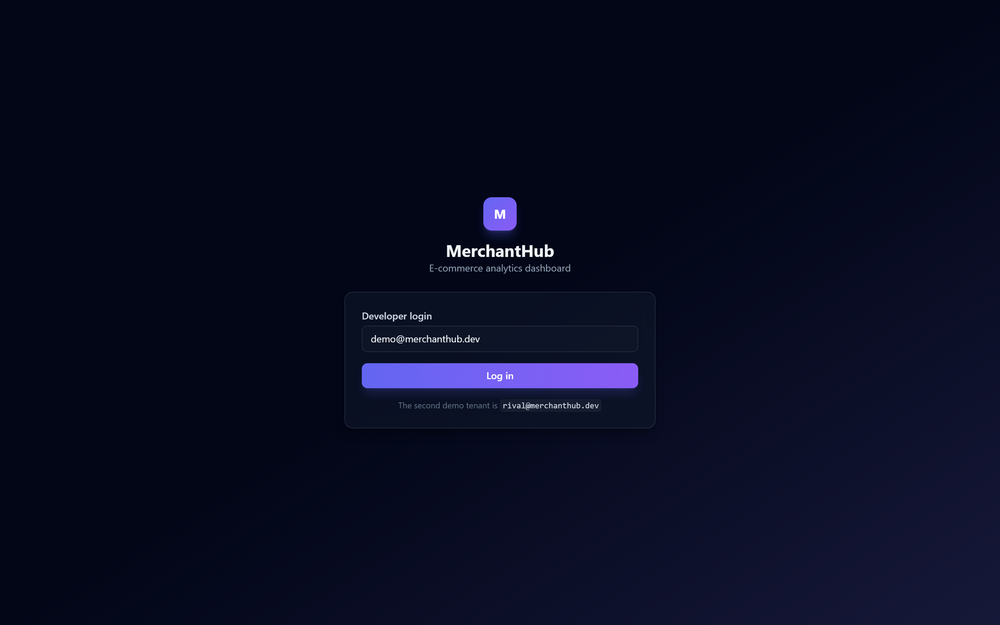

# MerchantHub — Multi-Tenant E-Commerce Analytics & Inventory Platform

A production-style SaaS dashboard for e-commerce merchants (inspired by ShopRenter).
Merchants connect their shop; the system ingests orders in real time, tracks inventory,
forecasts low stock, and surfaces sales analytics — all with **strict tenant isolation**
enforced at two independent layers.

> **Stack:** Java 21 + Spring Boot 3 · Next.js 14 (App Router) · PostgreSQL (Supabase-compatible) ·
> Node/Express mock shop API · Docker Compose · Tailwind + Recharts (dark UI)

---

## Screenshots

> Modern dark UI built with Tailwind CSS. Detail popups (order drawer, product modal)
> animate in and out. Data below is the bundled demo seed (`demo@merchanthub.dev`).

### Dashboard — server-side analytics
Revenue trend with period-over-period delta, order funnel, and top products.



### Animated detail popups

| Order detail drawer (slides in) | New-product modal (scales in) |
|---|---|
|  |  |

### Catalog, inventory & operations

| Products | Inventory (low-stock highlighted) |
|---|---|
|  |  |

| Orders | Alerts |
|---|---|
|  |  |

| Sync (push + pull ingestion) | Developer login |
|---|---|
|  |  |

<sub>Screenshots are captured from the running stack with `tools/shots/shoot.js` (Playwright). Regenerate with `cd tools/shots && npm install && node shoot.js`.</sub>

---

## Repository layout

```
merchanthub/
├── docker-compose.yml        # db + backend + mock-shop-api + frontend
├── .env.example              # all configuration (copy to .env to override)
├── db/init/                  # cluster-level role creation (runs once, before Flyway)
├── backend/                  # Spring Boot API (business logic, auth, analytics, sync)
│   └── src/main/resources/db/migration/   # Flyway: schema → RLS → demo seed
├── mock-shop-api/            # Express service emulating the external shop API
├── frontend/                 # Next.js dashboard (dark UI, SSR analytics, realtime)
└── tools/shots/              # Playwright screenshot script (dev tooling)
```

---

## Quick start (one command)

Prerequisites: **Docker** (with Compose v2). Nothing else — the JDK, Maven, and Node
toolchains all run inside the build containers.

```bash
docker compose up --build
```

Then open:

| Service        | URL                                   |
|----------------|---------------------------------------|
| Dashboard      | http://localhost:3000                 |
| Backend API    | http://localhost:8080/api             |
| Swagger UI     | http://localhost:8080/swagger-ui.html |
| Mock shop API  | http://localhost:4000/health          |

**Log in:** on the dashboard use **Developer login** with `demo@merchanthub.dev`
(the seed data's primary tenant). A second tenant — `rival@merchanthub.dev` — exists so
you can verify that neither merchant can ever see the other's data.

> First build takes a few minutes (Maven + npm dependency downloads). Subsequent runs are cached.

---

## The two isolation layers (defense-in-depth)

This is the headline of the project. A bug in one layer cannot leak data across tenants.

1. **Application layer (primary).** The Spring `JwtAuthFilter` validates the Supabase JWT,
   resolves the `merchant_id`, and pins it into a `TenantContext`. Every service query is
   scoped by that id.

2. **Database layer (safety net).** The backend connects as a **non-superuser Postgres role**
   (`merchanthub_app`) that has **no `BYPASSRLS`**. Before each transaction,
   `TenantIsolationAspect` runs `SET LOCAL app.current_merchant_id = '<uuid>'`, and the RLS
   policies in [`V2__rls_policies.sql`](backend/src/main/resources/db/migration/V2__rls_policies.sql)
   constrain every statement to that merchant — even if an application query forgets its
   `WHERE merchant_id = ?`.

   *Migrations* run as the admin/superuser (they create roles, extensions, RLS, seed data);
   only the *runtime* connects as the restricted role. This mirrors a real Supabase setup
   while making the RLS net genuinely demonstrable locally.

Lookups that must happen *before* a tenant context exists (login, webhook auth, the
all-tenant sync job) go through `SECURITY DEFINER` SQL functions, the only sanctioned way
to touch the `merchants` table unscoped.

---

## Feature tour

| Pillar | Where |
|---|---|
| **Tenant-scoped catalog & inventory CRUD** | `ProductService`, `InventoryService` + `/products`, `/inventory` |
| **CSV bulk import / export** | `POST /api/products/import`, `GET /api/products/export` |
| **Webhook ingestion (push)** | `WebhookController` → HMAC-SHA256 verified → `OrderIngestionService` |
| **Scheduled pull-sync (reliability)** | `SchedulingConfig` + `SyncScheduler` → `SyncService` (all tenants) |
| **Low-stock detection & alerts** | `InventoryService` raises `low_stock` alerts on threshold crossing |
| **Realtime notifications** | `alerts`/`orders` row changes → Supabase Realtime → dashboard toasts (polling fallback) |
| **Server-side analytics** | `AnalyticsService`: revenue trends + period compare, top products, funnel, forecast |
| **Inventory forecasting** | 30-day moving average → days-to-stockout (`/api/analytics/forecast`) |

### Try the ingestion paths

```bash
# Push: make the mock shop API deliver a signed new-order webhook to the backend.
curl -X POST "http://localhost:4000/shop/simulate/order?apiKey=demo-shop-key-acme"

# Pull: trigger an on-demand reconciliation sync (needs a Bearer token — grab one first).
TOKEN=$(curl -s -X POST http://localhost:8080/api/auth/dev-token \
  -H 'Content-Type: application/json' -d '{"email":"demo@merchanthub.dev"}' | jq -r .token)
curl -X POST http://localhost:8080/api/sync/run -H "Authorization: Bearer $TOKEN"
```

Either path produces a `new_order` alert (and a low-stock alert if a threshold is crossed),
which appears live in the dashboard's alert bell.

---

## Configuration

All settings live in [`.env.example`](.env.example) with sensible local defaults; copy to
`.env` to override. Highlights:

| Variable | Purpose |
|---|---|
| `SUPABASE_JWT_SECRET` | HS256 secret to validate (and, in dev, mint) JWTs. Set to your Supabase project's JWT secret in prod. |
| `DEV_AUTH_ENABLED` | Exposes `POST /api/auth/dev-token`. **Must be `false` in production.** |
| `WEBHOOK_SECRET` | HMAC key for verifying inbound shop webhooks. |
| `SYNC_INTERVAL_MS` | Pull-sync cadence. `0` disables the scheduler. |
| `NEXT_PUBLIC_SUPABASE_URL` / `_ANON_KEY` | Optional. Set to enable real Supabase Auth + Realtime; leave blank to use dev-token auth + polling. |

### Using a real Supabase project

1. Create a Supabase project; run the migrations in `backend/src/main/resources/db/migration`
   against it (or point Flyway at it via `DB_ADMIN_URL`).
2. Set `SUPABASE_JWT_SECRET` to the project's JWT secret and the `NEXT_PUBLIC_SUPABASE_*`
   vars to the project URL + anon key.
3. Set `DEV_AUTH_ENABLED=false`. The dashboard then uses Supabase Auth and subscribes to
   Realtime `postgres_changes` on `alerts`/`orders`.

---

## Running pieces individually (development)

```bash
# Mock shop API
cd mock-shop-api && npm install && npm start        # :4000

# Frontend (needs the backend running)
cd frontend && npm install && npm run dev           # :3000

# Backend needs a JDK 21 + Maven, or just use Docker:
docker compose up db backend
```

### Tests

The backend ships JUnit 5 + Testcontainers integration tests (real Postgres) covering
tenant isolation and signed-webhook ingestion:

```bash
cd backend && mvn test     # requires Docker for Testcontainers
```

---

## Architecture at a glance

```
Next.js dashboard ──REST + JWT──▶ Spring Boot API ──restricted role + SET LOCAL──▶ Postgres (RLS)
        ▲                                │  ▲                                           │
        └────── Supabase Realtime ───────┘  └── signed webhooks / scheduled pull ──▶ Mock Shop API
             (alerts / orders row changes)
```

- **Spring Boot** owns business logic, auth validation, tenant scoping, analytics
  aggregation, webhook ingestion, and the scheduled sync.
- **Next.js** owns all UX: SSR-friendly analytics pages, product/inventory management,
  realtime alert toasts, animated detail popups.
- **Postgres** is the system of record with RLS as the isolation safety net.

Module-level docs: see [`mock-shop-api/README.md`](mock-shop-api/README.md) and
[`frontend/README.md`](frontend/README.md).
