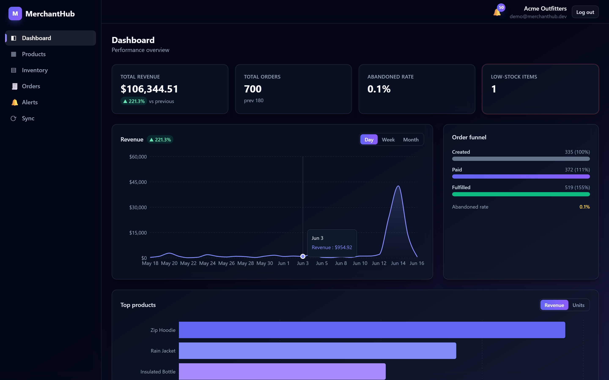
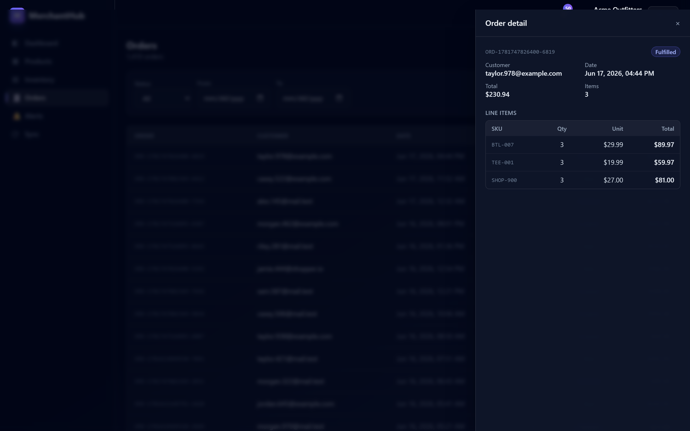
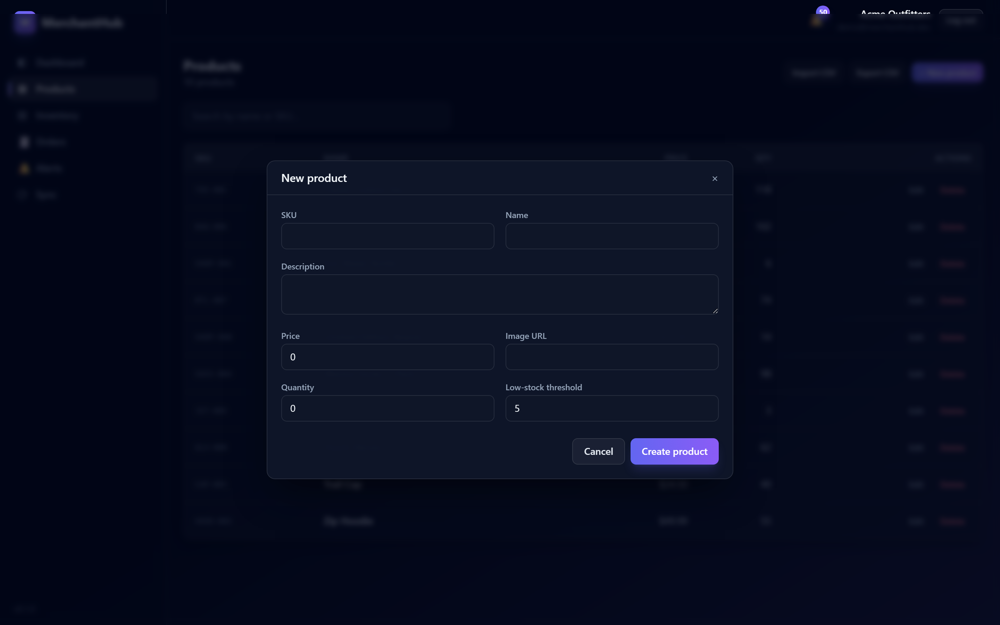
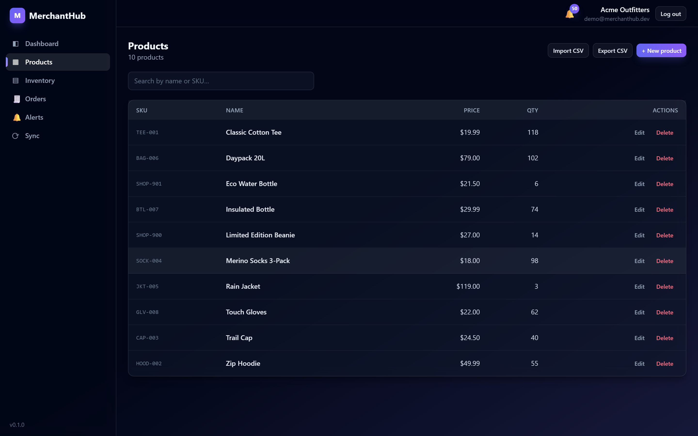
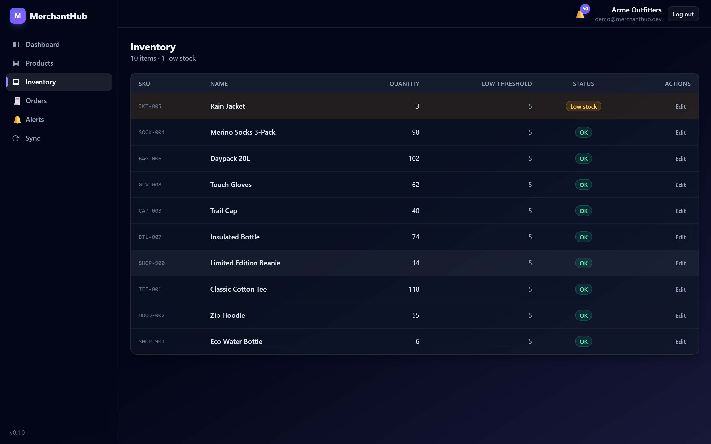
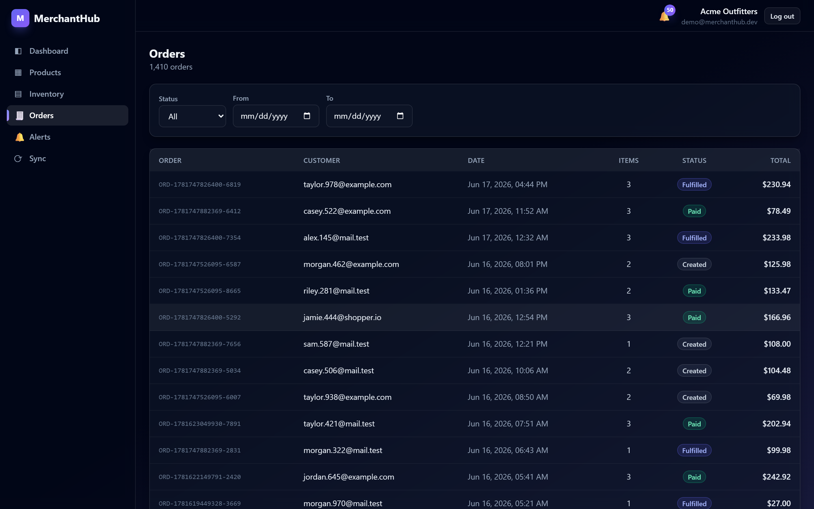
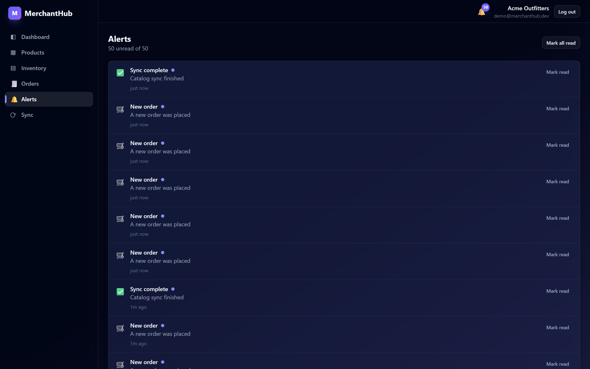
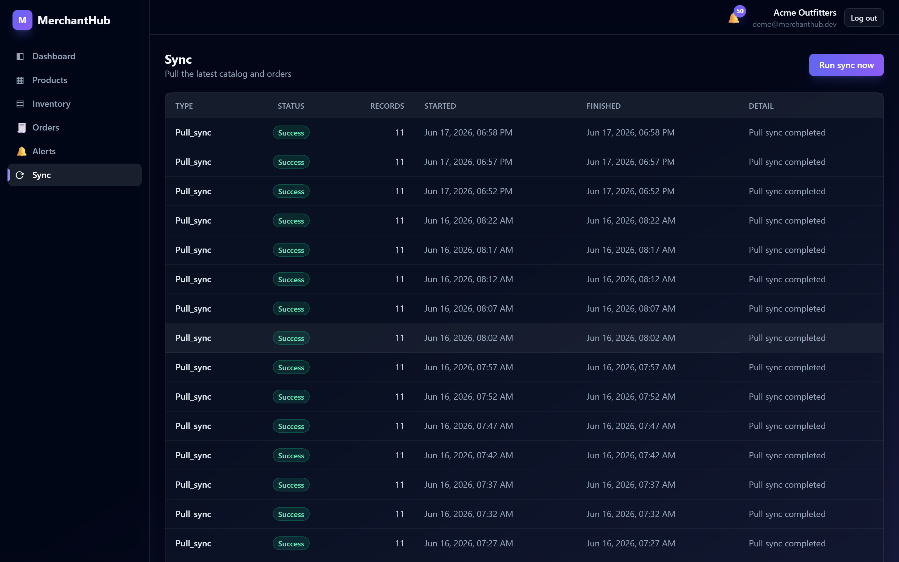
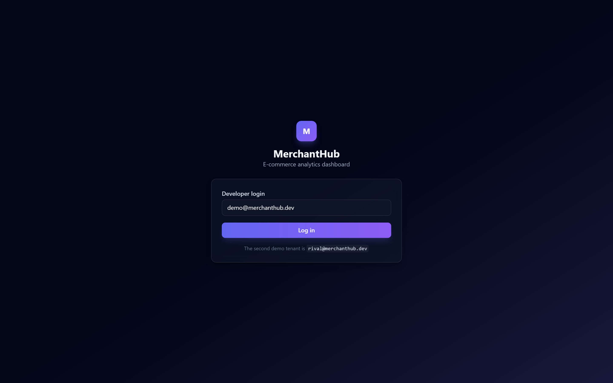

# MerchantHub — Multi-Tenant E-Commerce Analytics & Inventory Platform

A production-style SaaS dashboard for e-commerce merchants (inspired by ShopRenter).
Merchants connect their shop; the system ingests orders in real time, tracks inventory,
forecasts low stock, and surfaces sales analytics — all with **strict tenant isolation**
enforced at two independent layers.

> **Stack:** Java 21 + Spring Boot 3 · Quarkus · Kafka · Next.js 14 (App Router) · PostgreSQL ·
> Node/Express mock shop API · Docker Compose · Tailwind + Recharts (dark UI)

---

## Overview

Most "multi-tenant SaaS" demos stop at a `merchant_id` column and a `WHERE` clause. That's
the layer an easy-to-write bug can slip through — one forgotten filter and tenant A sees
tenant B's orders. MerchantHub exists to answer a narrower, harder question: **what does it
take to make that leak structurally impossible, not just unlikely?** The answer here is
defense-in-depth — application-layer scoping backed by a Postgres Row-Level Security net that
holds even when the application code doesn't (see [below](#the-two-isolation-layers-defense-in-depth)) — built around a scenario realistic
enough to need it: a shop connects, orders arrive by two independent paths, inventory reacts
to them, and the numbers get turned into analytics a merchant would actually look at.

Everything downstream of that core is built to be genuinely exercised, not just present for
show: two ingestion paths (signed webhook push + scheduled pull-sync) that converge on one
idempotent method so neither can double-count an order; a Kafka-based event boundary between
services, including a standalone Quarkus edge service built to a GraalVM native image for the
public webhook front door; server-computed analytics (revenue trends, funnel, stockout
forecasting) instead of client-side math; an AI-generated daily summary that's grounded in
those same numbers rather than free-floating LLM output; self-contained JWT auth with BCrypt
password hashing; and JUnit 5 + Testcontainers integration tests that prove the isolation
claim against a real Postgres, not a mock.

**Highlights:**
- **Two-layer tenant isolation** — Spring-side `TenantContext` scoping *and* Postgres RLS
  enforced against a non-superuser role, so a missing `WHERE merchant_id = ?` still can't
  leak data.
- **Dual order ingestion** — HMAC-signed webhooks (push, low-latency) and a scheduled
  reconciliation sync (pull, reliability backstop), both idempotent on `external_id`.
- **Polyglot microservices** — a Spring Boot core, a standalone Quarkus edge service for
  webhook verification, and a Spring Boot Kafka consumer for notifications, talking to each
  other over Kafka rather than direct HTTP calls.
- **Server-side analytics** — revenue trend + period-over-period comparison, top products,
  order funnel, and 30-day-moving-average stockout forecasting, all computed in SQL.
- **Applied GenAI, not a chatbot bolt-on** — a daily insights endpoint that grounds an
  Anthropic Claude summary in the exact analytics numbers the dashboard already shows, so
  nothing in the generated text is unverifiable.
- **Ops-shaped extras** — CSV report export to S3 via presigned URLs, and structured JSON
  logging with per-request/per-tenant correlation ids, the pattern a Splunk forwarder or HEC
  sidecar ingests directly off stdout.
- **Tested where it matters** — Testcontainers-backed integration tests prove tenant
  isolation, signed-webhook ingestion, and the auth flow against a real Postgres instance,
  not an in-memory substitute that behaves differently.

### Tech stack by concern

| Concern | Technology |
|---|---|
| Backend API | Java 21, Spring Boot 3, Spring Data JPA/Hibernate, Spring Security |
| Webhook edge service | Quarkus, GraalVM native image |
| Messaging | Apache Kafka (KRaft mode), transactional outbox pattern |
| Database | PostgreSQL 16, Row-Level Security, Flyway migrations |
| Frontend | Next.js 14 (App Router), React 18, TypeScript, Tailwind CSS, Recharts |
| Auth | Self-issued HS256 JWTs, BCrypt password hashing |
| Applied AI | Anthropic Claude (Messages API), grounded generation over server-computed analytics |
| Cloud | AWS S3 (presigned CSV export) |
| Observability | Structured JSON logging (Logstash encoder), per-request/tenant MDC correlation ids |
| Testing | JUnit 5, Testcontainers, Mockito |
| Infra | Docker Compose, multi-stage Docker builds |

---

## Screenshots

> Modern dark UI built with Tailwind CSS. Detail popups (order drawer, product modal)
> animate in and out. Data below is the bundled demo seed (`demo@merchanthub.dev`).

### Dashboard — server-side analytics
Revenue trend with period-over-period delta, order funnel, and top products.



### Animated detail popups

| Order detail drawer (slides in) | New-product modal (scales in) |
|---|---|
|  |  |

### Catalog, inventory & operations

| Products | Inventory (low-stock highlighted) |
|---|---|
|  |  |

| Orders | Alerts |
|---|---|
|  |  |

| Sync (push + pull ingestion) | Login |
|---|---|
|  |  |

<sub>Screenshots are captured from the running stack with `tools/shots/shoot.js` (Playwright). Regenerate with `cd tools/shots && npm install && node shoot.js`.</sub>

---

## Repository layout

```
merchanthub/
├── docker-compose.yml        # db + kafka + backend + webhook-ingest-service + notification-service + mock-shop-api + frontend
├── .env.example              # all configuration (copy to .env to override)
├── db/init/                  # cluster-level role creation (runs once, before Flyway)
├── backend/                  # Spring Boot API (business logic, auth, analytics, sync, AI insights, S3 export)
│   └── src/main/resources/db/migration/   # Flyway: schema → RLS → demo seed
├── webhook-ingest-service/   # Standalone Quarkus edge service: HMAC verify + merchant lookup → Kafka
├── notification-service/     # Spring Boot: consumes Kafka domain events, emits (simulated) notifications
├── mock-shop-api/            # Express service emulating the external shop API
├── frontend/                 # Next.js dashboard (dark UI, SSR analytics, realtime)
└── tools/shots/              # Playwright screenshot script (dev tooling)
```

---

## Quick start (one command)

Prerequisites: **Docker** (with Compose v2). Nothing else — the JDK, Maven, and Node
toolchains all run inside the build containers.

```bash
docker compose up --build
```

Then open:

| Service        | URL                                   |
|----------------|---------------------------------------|
| Dashboard      | http://localhost:3000                 |
| Backend API    | http://localhost:8080/api             |
| Swagger UI     | http://localhost:8080/swagger-ui.html |
| Mock shop API  | http://localhost:4000/health          |

**Log in:** on the dashboard, log in with `demo@merchanthub.dev` / `demo1234`
(the seed data's primary tenant). A second tenant — `rival@merchanthub.dev` / `demo1234` —
exists so you can verify that neither merchant can ever see the other's data. Or click
**Create account** to register a brand-new tenant from scratch.

> First build takes a few minutes (Maven + npm dependency downloads). Subsequent runs are cached.

---

## The two isolation layers (defense-in-depth)

This is the headline of the project. A bug in one layer cannot leak data across tenants.

1. **Application layer (primary).** The Spring `JwtAuthFilter` validates a self-issued JWT
   (`POST /api/auth/register`/`/login`), resolves the `merchant_id`, and pins it into a
   `TenantContext`. Every service query is scoped by that id.

2. **Database layer (safety net).** The backend connects as a **non-superuser Postgres role**
   (`merchanthub_app`) that has **no `BYPASSRLS`**. Before each transaction,
   `TenantIsolationAspect` runs `SET LOCAL app.current_merchant_id = '<uuid>'`, and the RLS
   policies in [`V2__rls_policies.sql`](backend/src/main/resources/db/migration/V2__rls_policies.sql)
   constrain every statement to that merchant — even if an application query forgets its
   `WHERE merchant_id = ?`.

   *Migrations* run as the admin/superuser (they create roles, extensions, RLS, seed data);
   only the *runtime* connects as the restricted role, so the RLS net is genuinely
   demonstrable locally, not just decorative.

Lookups that must happen *before* a tenant context exists (login, webhook auth, the
all-tenant sync job) go through `SECURITY DEFINER` SQL functions, the only sanctioned way
to touch the `merchants` table unscoped.

---

## Feature tour

| Pillar | Where |
|---|---|
| **Tenant-scoped catalog & inventory CRUD** | `ProductService`, `InventoryService` + `/products`, `/inventory` |
| **CSV bulk import / export** | `POST /api/products/import`, `GET /api/products/export` |
| **Webhook ingestion (push)** | `webhook-ingest-service` (Quarkus) verifies HMAC-SHA256 + resolves merchant at the edge → Kafka → `WebhookEventListener` persists |
| **Scheduled pull-sync (reliability)** | `SchedulingConfig` + `SyncScheduler` → `SyncService` (all tenants) |
| **Low-stock detection & alerts** | `InventoryService` raises `low_stock` alerts on threshold crossing |
| **Realtime notifications** | 10-second poll for unread alerts → dashboard toasts |
| **Event-driven microservice** | Backend outbox → Kafka → `notification-service` consumes `order.ingested` / `inventory.low-stock` |
| **Server-side analytics** | `AnalyticsService`: revenue trends + period compare, top products, funnel, forecast |
| **Inventory forecasting** | 30-day moving average → days-to-stockout (`/api/analytics/forecast`) |
| **AI daily insights (GenAI)** | `InsightsService` grounds an Anthropic Claude summary in the real revenue + forecast numbers (`/api/insights/daily-summary`) |
| **Order-report export to S3** | `ReportExportService` uploads a CSV to S3 and returns a 15-minute presigned link (`POST /api/reports/orders/export`) |
| **Splunk-ready structured logs** | JSON logs (per-request + per-tenant MDC fields) on stdout — `SPRING_PROFILES_ACTIVE=dev,json` |

### Try the ingestion paths

```bash
# Push: make the mock shop API deliver a signed new-order webhook to the backend.
curl -X POST "http://localhost:4000/shop/simulate/order?apiKey=demo-shop-key-acme"

# Pull: trigger an on-demand reconciliation sync (needs a Bearer token — grab one first).
TOKEN=$(curl -s -X POST http://localhost:8080/api/auth/login \
  -H 'Content-Type: application/json' -d '{"email":"demo@merchanthub.dev","password":"demo1234"}' | jq -r .token)
curl -X POST http://localhost:8080/api/sync/run -H "Authorization: Bearer $TOKEN"
```

Either path produces a `new_order` alert (and a low-stock alert if a threshold is crossed),
which appears live in the dashboard's alert bell.

---

## Configuration

All settings live in [`.env.example`](.env.example) with sensible local defaults; copy to
`.env` to override. Highlights:

| Variable | Purpose |
|---|---|
| `JWT_SECRET` | HS256 secret this service signs and validates its own JWTs with. **Generate a real random one for prod** — this is the only credential guarding every tenant's data. |
| `WEBHOOK_SECRET` | HMAC key for verifying inbound shop webhooks. |
| `SYNC_INTERVAL_MS` | Pull-sync cadence. `0` disables the scheduler. |
| `ANTHROPIC_API_KEY` | Enables `GET /api/insights/daily-summary`. Blank → endpoint still responds with the real numbers, `aiAvailable:false`. |
| `REPORTS_S3_BUCKET` / `REPORTS_S3_ENDPOINT_OVERRIDE` | Enables `POST /api/reports/orders/export`. Point the override at LocalStack/MinIO for local dev without real AWS. |

### Auth model

Self-contained — no external identity provider. `POST /api/auth/register` creates a merchant
with a BCrypt-hashed password (`V5__auth_password.sql`); `POST /api/auth/login` checks it and
mints an HS256 JWT (`JwtService`) that `JwtAuthFilter` validates on every `/api/**` request
after that. Deploying for real is just: set a strong random `JWT_SECRET`, run behind TLS, and
consider adding short token TTLs + refresh (see `docs/INTERVIEW_QA.md` §9 for the hardening
discussion).

---

## Running pieces individually (development)

```bash
# Mock shop API
cd mock-shop-api && npm install && npm start        # :4000

# Frontend (needs the backend running)
cd frontend && npm install && npm run dev           # :3000

# Backend needs a JDK 21 + Maven, or just use Docker:
docker compose up db backend

# webhook-ingest-service (Quarkus) in dev mode — live reload on :8082
cd webhook-ingest-service && mvn quarkus:dev

# ...or build a GraalVM native image (requires a GraalVM install):
cd webhook-ingest-service && mvn -Pnative package
./target/webhook-ingest-service-0.1.0-runner
```

### Tests

The backend ships JUnit 5 + Testcontainers integration tests (real Postgres) covering
tenant isolation and signed-webhook ingestion:

```bash
cd backend && mvn test     # requires Docker for Testcontainers
```

---

## Architecture at a glance

```
                                            ┌── Anthropic API (AI daily insights)
                                            ├── S3 (order-report export)
                                            ▼
Next.js dashboard ──REST + JWT──▶ Spring Boot API ──restricted role + SET LOCAL──▶ Postgres (RLS)
        ▲                                │  ▲   ▲                                        │
        │                                │  │   └── order.ingested / inventory.low-stock ─┴──▶ Kafka ──▶ notification-service
        │                                │  └── order.webhook.received ◀── Kafka ◀── webhook-ingest-service (Quarkus)
        └────── 10s alert polling ───────┘                                                     ▲
                                                                          HMAC-verified webhook ──┘
                                                                                Mock Shop API
```

- **Spring Boot** owns business logic, auth validation, tenant scoping, analytics
  aggregation, webhook persistence, and the scheduled sync.
- **Quarkus** (`webhook-ingest-service`) is the public webhook front door: HMAC verification
  and merchant lookup happen there, native-image-fast, decoupled from the backend's
  deploy/restart cadence — it only talks to Postgres (read-only) and Kafka, never to the
  backend directly.
- **Kafka** is the event bus for both the webhook hand-off and the outbox-published domain
  events (`order.ingested`, `inventory.low-stock`) that `notification-service` consumes.
- **Next.js** owns all UX: SSR-friendly analytics pages, product/inventory management,
  realtime alert toasts, animated detail popups.
- **Postgres** is the system of record with RLS as the isolation safety net.

**Learning the backend?** [`docs/BACKEND_GUIDE.md`](docs/BACKEND_GUIDE.md) is a guided,
teaching-oriented walkthrough of every part of the Spring Boot backend (DI, JPA, security,
AOP/transactions, the two-layer tenant isolation, analytics SQL, scheduling) with a suggested
reading order and exercises.

**Interviewing with this project?** [`docs/INTERVIEW_QA.md`](docs/INTERVIEW_QA.md) is a Java +
Spring Boot interview prep pack — ~120 Q&A with model answers covering the project design and
the fundamentals it demonstrates (IoC/DI, transactions/AOP, JPA, Spring Security/JWT, RLS,
testing, Docker, core Java), plus "war stories" for the inevitable *"tell me about a hard bug."*

Module-level docs: see [`mock-shop-api/README.md`](mock-shop-api/README.md) and
[`frontend/README.md`](frontend/README.md).
